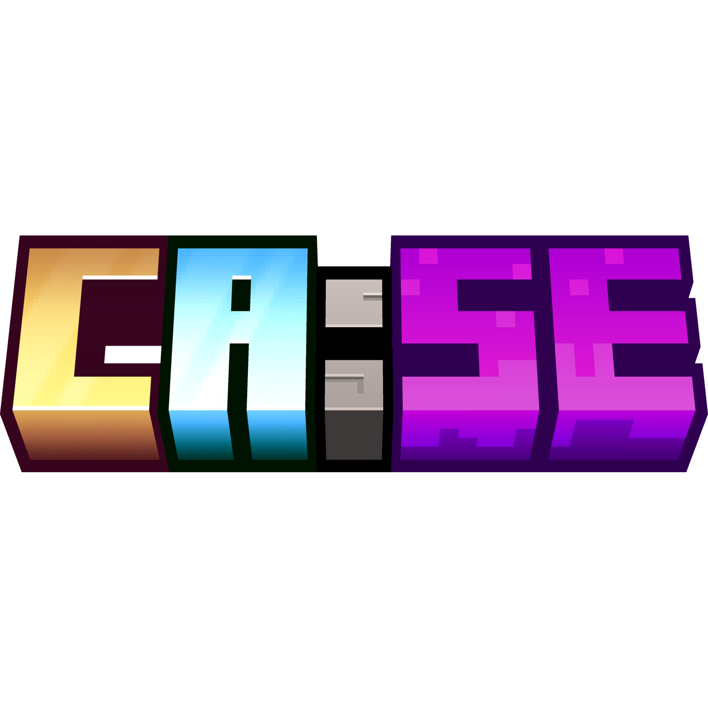

# CASE — Create Aeronautics: Space Exploration



CASE is a Minecraft **1.21.1 / NeoForge 21.1.248** modpack built around Create,
Aeronautics, technology progression, custom recipes, and quests.

## Release 0.1

This repository contains release snapshots only. Active development is maintained
separately. Version 0.1 is prepared for CurseForge; the archive is
`CASE-0.1-curseforge.zip`. Its checksum is recorded in
[release metadata](documentation/release.json). Uploading the pack to CurseForge
is managed by the author.

Import the CurseForge ZIP into PrismLauncher with **Add Instance → Import**,
or install the published pack through CurseForge. Use Java 21. The archive uses
308 CurseForge project/file references; mod JARs are downloaded from their hosts.
No mod JARs are stored in this repository or bundled in the archive.

## Included source

- `config/`: directly managed pack data, including quests and recipe settings.
- `configureddefaults/`: selected defaults copied into missing config files.
- `fancymenu_data/`: FancyMenu's existing runtime folder name; menu configuration
  and assets also live inside the config folders.
- `kubejs/`: scripts, data, and assets used by the pack.
- `resourcepacks/`: CASE Resourcepack ZIP plus external-pack download metadata.
- `shaderpacks/`: shader text settings plus download metadata.
- `mods/`: packwiz download metadata only.

External resource-pack and shader ZIPs are downloaded through the manifest.
The `.pw.toml` files are packwiz metadata, not bundled mods or packs.

The tested `assets/`, `data/`, and `defaultconfigs/` content is also included.
To validate and export the native CurseForge release with Python 3.11+ and packwiz:

```sh
python scripts/validate.py
packwiz curseforge export -o CASE-0.1-curseforge.zip
```

The repository starts with a clean release snapshot; private development history
is not included. Publishing releases is managed by BriderMC.

## Changes in 0.1

- Updated the main CASE instance's quests.
- Synchronized Configured Defaults and starterstructure with the main instance,
  including removal of the default options, FTB quest optimizer world template,
  and bundled spawn schematic.
- Uses the approved CurseForge versions and platform-specific resource packs.
- CASE Curios, its two predecessors, and Sable Weighted Add-On Bundle are excluded.

## License and credits

CASE's original source is covered by [MIT](LICENSE). Third-party content retains
its own licenses. See [credits and attribution](documentation/credits.md).
